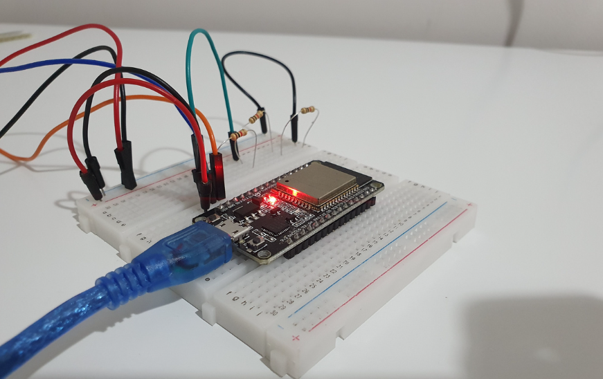
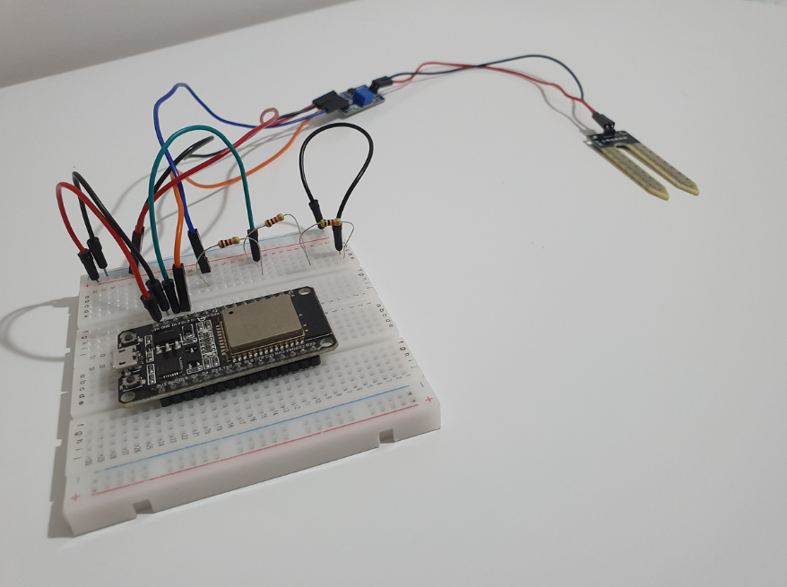
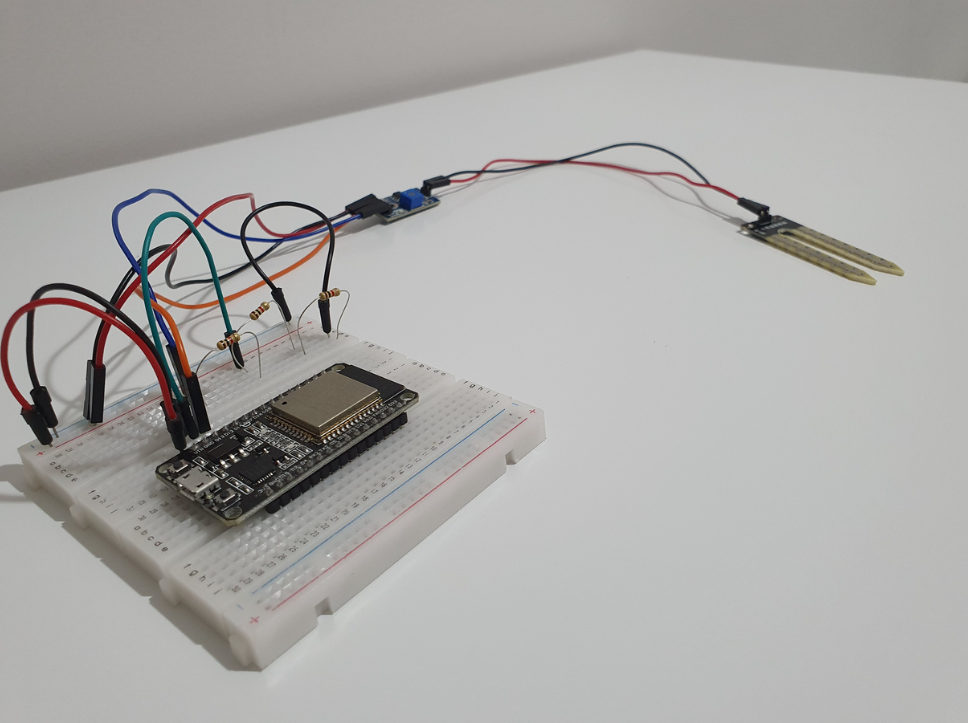
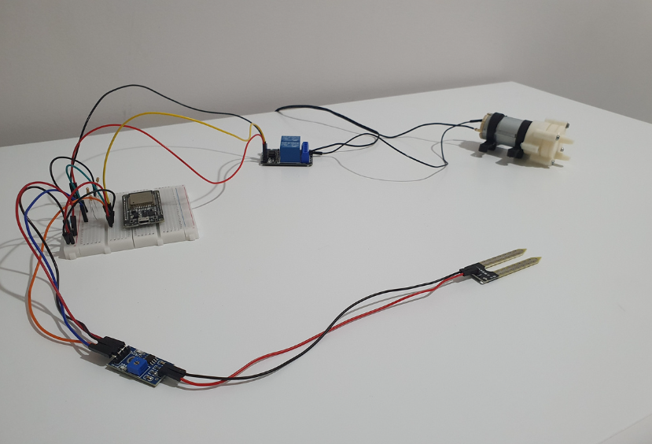
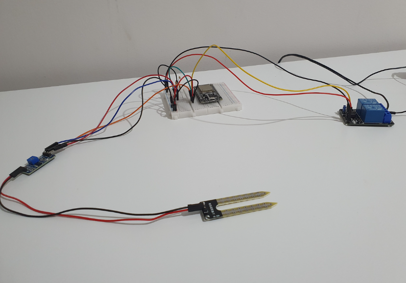
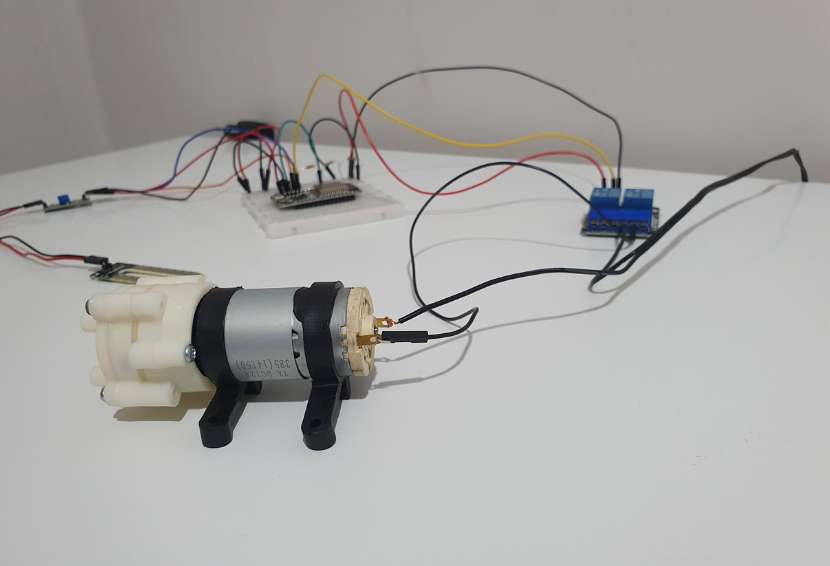
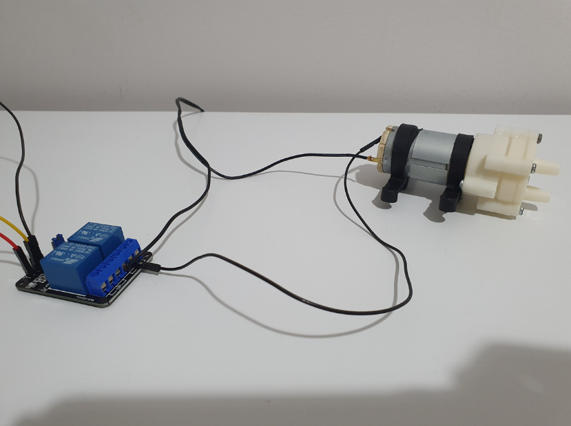

# Sistema de Irrigação Automática 💦🪴

Este é o projeto final da disciplina de Sistemas Embarcadas 2022.2.

## ❕ Descrição

Um sistema de irrigação automático para plantas.

## 🔌 Componentes

### Microcontrolador

Em nosso projeto vamos utilizar o ESP-32, modelo WROOM-32D ([datasheet](Docs/datasheets/esp32-wroom-32_datasheet_en.pdf)), principal microcontrolador utilizado na disciplina e o coração do nosso sistema.

Ele nada mais é do que uma placa de desenvolvimento de código aberto que utiliza o chip ESP32.

Possui Wi-Fi e Bluetooth nativo, dessa forma, essa placa é ideal para projetos de automação residencial e internet das coisas.

### Sensor de Umidade do Solo Higrômetro

  

Este Sensor de Umidade do Solo Higrômetro foi feito para detectar as variações de umidade no solo, sendo que quando o solo está seco a saída do sensor fica em estado alto (HIGH), e quando úmido em estado baixo (LOW) sua tensão de operação é de 3,3 a 5V.

O mesmo consiste em 2 partes: uma sonda que entra em contato com o solo, e um pequeno módulo contendo um chip comparador LM393 ([datasheet](Docs/datasheets/Datasheet_LM393.pdf)), que vai ler os dados que vêm do sensor e enviá-los para o microcontrolador, no nosso caso, o ESP32.

### Mini Bomba de Água

A Mini Bomba de Água RS385 opera com tensão entre 9V a 15V e permite elevação máxima de até 3 metros e altura de aspiração de até 2 metros.

### Outros componentes

-

## 🧩 Diagrama de Blocos

## 🔄 Fluxograma do Firmware

## 🖼️ Screenshots do Front End

## Imagens das Etapas de Desenvolvimento

  
  
  
  
  
  
  

## 👥 Participantes
