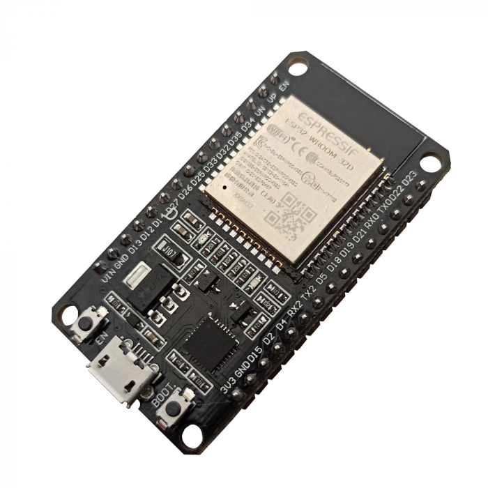

# Sistema de Irrigação Automática 💧🪴

Este é o projeto final da disciplina de Sistemas Embarcadas 2022.2.

Apresentação YouTube: <https://youtu.be/aDN4pBqXoVA>

## Sumário

- [Sistema de Irrigação Automática 💧🪴](#sistema-de-irrigação-automática-)
  - [Sumário](#sumário)
  - [❕ Descrição](#-descrição)
  - [🚀 Como montar e executar o sistema](#-como-montar-e-executar-o-sistema)
  - [🔌 Componentes](#-componentes)
    - [Microcontrolador](#microcontrolador)
    - [Sensor de Umidade do Solo Higrômetro](#sensor-de-umidade-do-solo-higrômetro)
    - [Mini Bomba de Água](#mini-bomba-de-água)
    - [Outros componentes](#outros-componentes)
  - [🧩 Diagrama de Blocos](#-diagrama-de-blocos)
  - [🔄 Fluxograma do Firmware](#-fluxograma-do-firmware)

  - [🖼️ Preview do Front End](#️-preview-do-front-end)
  - [👣 Imagens do sistema](#-imagens-do-sistema)
  - [👥 Participantes](#-participantes)

---

## ❕ Descrição

Um sistema de irrigação automático para plantas. Em seu hardware, possui um ESP-32, juntamente com alguns componentes, para fazer leitura e controle da umidade de solo. Por sua vez, o ESP-32 se comunica com um Back End, mandando informações sobre o processo de irrigamente, e recebendo a porcentagem ideal de umidade pra irrigar o solo. A comunição é feita via MQTT utilizando RabbitMQ como broker. As informações recebidas pelo Back End são mostradas em Front End via navegador, será mostrado um histórico, e também, será possível enviar alguma umidade para o ESP-32 começar o irrigamento.

## 🚀 Como montar e executar o sistema

A parte de software da aplicação é divida em 3 partes: firmware do ESP-32, Front End e Back End com banco de dados H2 e RabbitMQ.

Sobre o firware do ESP-32, ele foi feito usando o ESP-IDF com a linguagem de programação C com CMake, um framework da Espressif para desenvolvimento de aplicações para dispositivos da família ESP-32. Para "buildar" o projeto e rodar ele no ESP-32, basta seguir os passos na [documentação Espressif](https://docs.espressif.com/projects/esp-idf/en/latest/esp32/get-started/index.html#manual-installation).

O Front End do sistema foi feito com React, ViteJS, Tailwind e algumas outras bibliotecas Javascript. Para rodar o Front é necessário ter o NodeJS instalado na máquina. Após a instalação, basta entrar na pasta do projeto, abrir um terminal e digitar `yarn dev:host`.

Para o Back End, é necessário ter Java 17 e Gradle instalados. Feito isso, basta ir na pasta do projeto, abrir um terminal e digitar `./gradlew bootRun`. Além do uso do Java, foi usado alguns frameworks do ecossistema Spring, como Spring Boot e Spring Data. No Back, também configuramos e usamos o banco de dados SQL H2, que é um banco _in-memory_ usado geralmente para testes em aplicações Java. Nesse banco, ficará guarado as informações do irrigamento mandadas pelo ESP-32 pelo MQTT. Esse banco foi usado apenas para mostrar como ocorre a persistência dos dados e ajudar no desenvolvimento.

Além de configurar Front e Back, é necessário configurar o RabbitMQ, que é um broker AMQP, mas que possui suporte também para MQTT. Uma forma de iniciar o RabbitMQ é usando Docker, e fazemos isso com `docker run --name rabbitmq-mqtt -p 1883:1883 -p 5672:5672 -p 15672:15672 -p 15675:15675 -d rabbitmq:3.10-management`, feito isso, é necessário "entrar" no conteiner do RabbitMQ e por o plugin de suporte ao MQTT, e isso pode ser feito seguindo o [tutorial](https://www.rabbitmq.com/mqtt.html).

Voltando ao contexto do firmware do ESP-32, é necessário por bssid e senha do WiFi para que ele se comunique via MQTT, e também por IP, porta, usuário e senha de acesso ao RabbitMQ.

## 🔌 Componentes

### Microcontrolador

  

Em nosso projeto vamos utilizar o ESP-32, modelo WROOM-32D ([datasheet](Docs/Datasheets/esp32-wroom-32_datasheet_en.pdf)), principal microcontrolador utilizado na disciplina e o coração do nosso sistema.

Ele nada mais é do que uma placa de desenvolvimento de código aberto que utiliza o chip ESP32.

Possui Wi-Fi e Bluetooth nativo, dessa forma, essa placa é ideal para projetos de automação residencial e internet das coisas.

### Sensor de Umidade do Solo Higrômetro

  

Este Sensor de Umidade do Solo Higrômetro foi feito para detectar as variações de umidade no solo, sendo que quando o solo está seco a saída do sensor fica em estado alto (HIGH), e quando úmido em estado baixo (LOW) sua tensão de operação é de 3,3 a 5V.

O mesmo consiste em 2 partes: uma sonda que entra em contato com o solo, e um pequeno módulo contendo um chip comparador LM393 ([datasheet](Docs/Datasheets/Datasheet_LM393.pdf)), que vai ler os dados que vêm do sensor e enviá-los para o microcontrolador, no nosso caso, o ESP32.

### Mini Bomba de Água

A Mini Bomba de Água RS385 opera com tensão entre 9V a 15V e permite elevação máxima de até 3 metros e altura de aspiração de até 2 metros.

### Outros componentes

-

## 🧩 Diagrama de Blocos

=======

## 🔄 Fluxograma do Firmware

## 🖼️ Preview do Front End

  

## 👣 Imagens do sistema

  
  
  

## 👥 Participantes

- [Ayrton Dantas](https://github.com/AYRtonMeD)
- [Guilherme Esdras](https://github.com/GuilhermeEsdras)
- [José Henrique](https://github.com/Joshaby)
